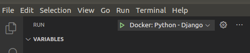

**BodhiTree** is an online learning platform developed at IIT Bombay with the mission of providing accessible quality technical education for all, through personalized, flexible, and hands-on complete learning.

# Commands for local setup

## Clone repository
```bash
https://github.com/suraj-iitb/bodhitree.git
```

## Create settings.ini file
```bash
cp main/settings.ini.sample main/setings.ini
```
Note: Modify settings.ini file configuration

## Containers up
```bash
docker-compose -f docker-compose.yml -f docker-compose.debug.yml up -d --build
```

## Run dev server (with debugger)
1. Install **bodhitree extension pack by bodhitree-iitb** in VS Code
2. Click on green traingle to run the dev server & start the debugger

    

2. Access API via http://localhost:8765/accounts in browser

## Run dev server (without debugger)
1. Go to the bash of the backend container
```bash
docker exec -i -t bodhitree_backend_1 bash
```
2. Run following command:
```bash
python manage.py runserver 0.0.0.0:8764
```
3. Access API via http://localhost:8764/accounts in browser

# Setup pre-commit hooks (flake8, black, isort)
1. Install python3.9
```bash
sudo apt update
sudo apt install software-properties-common
sudo add-apt-repository ppa:deadsnakes/ppa
sudo apt-get install python3.9 python3.9-distutils python3.9-venv
```
2. Create virtual env & activate
```bash
python3.9 -m venv pre_commit_env
source pre_commit_env/bin/activate
```
3. Install packages & hooks
```bash
pip3.9 install pre-commit
pre-commit install
```

**Note**:
1. Whenever you try to commit, these hooks (flake8, black, isort) will get activated. It will perform checks & rectify code.
2. You can also manually run these hooks on all files using following command:
```bash
pre-commit run --all-files
```
3. Hooks work only on tracked files.

# Commands for deployment

## Clone repository
```bash
https://github.com/suraj-iitb/bodhitree.git
```

## Create settings.ini file
```bash
cp main/settings.ini.sample main/setings.ini
```
Note: Modify settings.ini file configuration

## Containers up
```bash
docker swarm init
docker stack deploy -c docker-compose.yml -c docker-compose.prod.yml <INSTANCE_NAME>
```

## Access API
Access API via http://0.0.0.0:8765/accounts in browser
